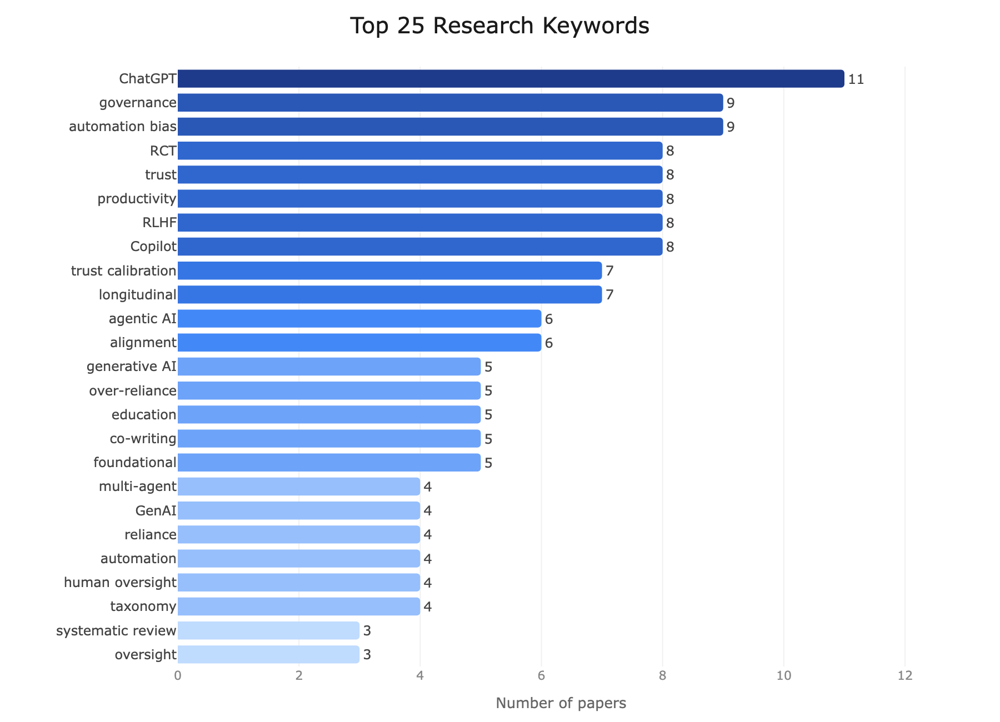

# Awesome Human-AI Coevolution Paper List

A curated index of **184** research papers on **how humans must evolve to use AI well as AI advances**. Organized by the four-phase framework — _Humans Use AI as Tool · Assistant · Executor · Organization_. Each paper is grounded evidence for one phase: what capability humans must sustain at that phase, how it weakens without active effort, and how AI systems can be designed to support that human evolution.

> As humans delegate more to AI, the capabilities humans need shift: from critical thinking, to evaluative expertise, to metacognitive monitoring, to systems thinking. When human evolution lags AI advancement, the failure modes pile up: weakened reasoning, polished-but-flawed artifacts approved, autonomous workflows drifting unmonitored, coordinated agent systems running opaque. This index curates the research that documents that human side.

The structured store [`papers.yaml`](papers.yaml) is the source of truth — the README, statistics, and the website are auto-generated from it. See [`CLAUDE.md`](CLAUDE.md) for the schema and contribution workflow.

## Index by Phase
**Phase 1** (50) · **Emerging Phase 2** (13) · **Phase 2** (44) · **Emerging Phase 3** (6) · **Phase 3** (18) · **Emerging Phase 4** (28) · **Phase 4** (0) · **Surveys & Position Papers** (25)

### Secondary axis — paper themes

`CC` **Collaboration & Co-Creation** (59) · `MA` **Mutual Adaptation** (58) · `HF` **Human Feedback Loops** (31) · `LH` **Longitudinal HCI Studies** (59) · `PS` **Position & Survey** (68)

## Top Keywords
`ChatGPT` (11) · `governance` (9) · `automation bias` (9) · `RCT` (8) · `trust` (8) `productivity` (8) · `RLHF` (8) · `Copilot` (8) · `trust calibration` (7) · `longitudinal` (7) `agentic AI` (6) · `alignment` (6) · `generative AI` (5) · `over-reliance` (5) · `education` (5) `benchmark` (3) · `dataset` (3) · `survey` (3)

## Top Contributing Authors
Mor Naaman (6) · Zahra Zahedi (5) · Subbarao Kambhampati (5) · Diyi Yang (4) · Daniel Buschek (4) Sarath Sreedharan (4) · Dario Amodei (4) · Mina Lee (3) · Kevin Wei (3) · Noam Kolt (3) Sandhini Agarwal (3) · Eric Horvitz (3) · Ethan Perez (3) · Samuel R. Bowman (3) · Amanda Askell (3) Jeffrey T. Hancock (3) · Jan Leike (3) · Raja Parasuraman (3) · Vishakh Padmakumar (2) · Judy Hanwen Shen (2)

## Contributing

We welcome contributions from the community!

- **Missing a paper?** Open an issue with the paper title, link, and any relevant details — we'll add it.
- **Want to add papers yourself?** Edit [`papers.yaml`](papers.yaml), run `bash scripts/update_repo.sh`, then submit the regenerated diff. See [`CLAUDE.md`](CLAUDE.md) for the YAML schema.
- **Spotted an error?** Open an issue or PR to correct any paper metadata (authors, dates, institutions, etc.).

## Browse the index

> Full searchable index: **<https://xli04.github.io/Awesome-Human-AI-Coevolution-Paper-List/>**. Structured source of truth: [`papers.yaml`](papers.yaml) (184 entries). Framework definitions: [`deep_research/phased_framework.md`](deep_research/phased_framework.md). Each paper is assigned a single phase, with `emerging-phase-X` for clear bridge cases; the secondary 5-category axis (CC/MA/HF/LH/PS) is also stored per entry.

### Phase 1 — Humans Use AI as Tool  (50 papers)

_Humans use AI to answer questions. To use AI well here, humans must sustain **critical thinking** — comparing AI outputs against their own reasoning rather than absorbing them passively. The capability erodes through uncritical acceptance, and the feedback that erosion produces pushes models toward sycophancy._

### Emerging Phase 2 — Tool → Assistant  (13 papers)

_Papers that bridge reasoning-level use with artifact production. Humans use AI to prompt their thinking but begin to produce drafts or ideation material that needs evaluation, not just judgement._

### Phase 2 — Humans Use AI as Assistant  (44 papers)

_Humans use AI to produce bounded artifacts (drafts, code snippets, partial implementations) and verify them. To use AI well here, humans must sustain **evaluative expertise** — knowing what good work satisfies, including failure modes. The capability erodes when polished output is accepted on surface signals._

### Emerging Phase 3 — Assistant → Executor  (6 papers)

_Papers that bridge artifact-level assistance with end-to-end autonomy. Humans still drive the workflow but begin to delegate sequences of steps, demanding monitoring on top of evaluation._

### Phase 3 — Humans Use AI as Executor  (18 papers)

_Humans use AI to complete end-to-end workflows, setting goals and intervening when execution drifts. To use AI well here, humans must practice **metacognitive monitoring** — selective inspection of where the workflow can fail. The capability erodes through passive supervision, producing scaled errors humans cannot catch in time._

### Emerging Phase 4 — Executor → Organization  (28 papers)

_Papers that bridge autonomous-agent use with system-level coordination. Includes governance-layer interventions on ecosystem feedback loops, constitutional / RLAIF systems, and the model-collapse line of work — contributions that argue *toward* Phase 4 governance without demonstrating a domain having fully arrived there._

### Phase 4 — Humans Use AI as Organization  (0 papers)

_Humans use AI to coordinate systems of work across many agents. To use AI well here, humans must develop **systems thinking** — shaping the system that produces actions rather than inspecting each action. No domain has officially entered Phase 4 yet, so this section is intentionally empty, and the **Emerging Phase 4** section above lists the papers that argue toward this mode._

### Surveys & Position Papers  (25 papers)

_Surveys, position pieces, and theoretical frameworks that span multiple phases — scaffolding for how to think about humans using AI well, rather than grounded evidence for any one phase._

---

Some of the design and scaffolding here is adapted from [OSU-NLP-Group/GUI-Agents-Paper-List](https://github.com/OSU-NLP-Group/GUI-Agents-Paper-List). Thanks for their awesome work!
